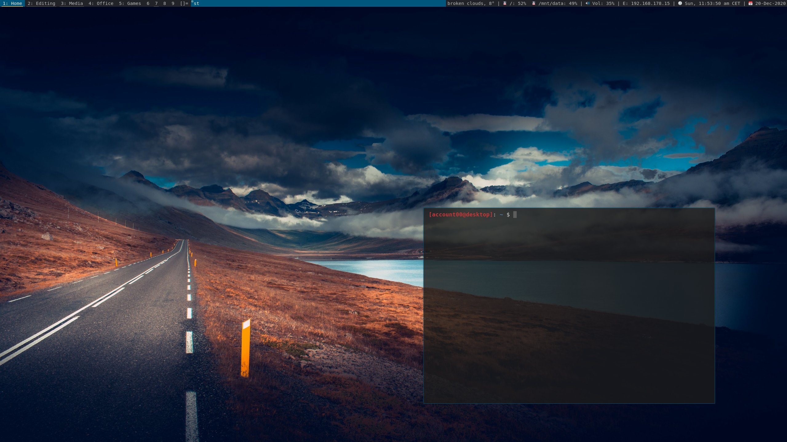

# dwm - dynamic window manager | my custom build
[dwm](https://dwm.suckless.org/) is an extremely fast, small, and dynamic window manager for X.

| main screen | secondair screen |
| :---: | :---: |
|  |  |

dwm out of the box has the necessary features. Through patches you can determine what features you would like to add. patches can be found on the [suckless.org](https://dwm.suckless.org/patches/) website. The more I use it the more patches I add/modify (for learning purpose and just trying out new patches if they fit my need). The patches that I added:  
| | |
| :---: | :---: |
alpha | stacker
attachbottom | staticstatus
center | steam
cyclelayouts | swallow
fullscreen (modified) | [switchtag](https://github.com/bakkeby/patches/blob/master/dwm/dwm-switchtag-6.2.diff)
noborder | tagothermonitor
pertag | [tagswapmon](https://github.com/bakkeby/patches/blob/master/dwm/dwm-tagswapmon-6.2.diff)
resetlayout | vanitygaps
restartsig | warp
scratchpads | xrdb
---

## Features
+ Add indicator line on active or occupied tag which color can be changed in config.h
+ Status on one specified monitor keeps updating regardless which monitor is active 
+ Pertag keeps settings per tag
+ Toggle attach top/bottom (`MODKEY + Shitf + d`)
+ Reset `nmaster`, `layout`, and `mfact` when last window on tag closes or with keybinding
+ No border when one window or in monocly mode
+ Vanitygaps for gaps between windows and screen
+ Scratchpads for quick access to terminal
+ Swallow for saving space when a program is opend trough a termnial
+ Change colors with Xresources and reload with `MODKEY + F5`
  + `dwm.normbgcolor: <COLOR>`
  + `dwm.normfgcolor: <COLOR>`
  + `dwm.normbordercolor: <COLOR>`
  + `dwm.selbgcolor: <COLOR>`
  + `dwm.selfgcolor: <COLOR>`
  + `dwm.selbordercolor: <COLOR>`
  + `dwm.linecolor: <COLOR>`
  + `dwm.linecolor: <COLOR>`
+ Included layouts whitch can cycled through:
  + Bound to key: tile, monocle, spiral, bstack, floating (`MODKEY + t/m/y/u/f`)
  + Not bound to key: dwindle, deck, bstackhoriz, grid, nrowgrid, horizgrid, gapplessgrid, centerdmaster, centerdfloatingmaster
---

## Dependencies
In order to build dwm you need:
+ libxft (or [libxft-bgra](https://aur.archlinux.org/packages/libxft-bgra/) for colored font and emojis)
+ [st](https://st.suckless.org/), or my own build of [st](https://github.com/arieboven/st)
+ [dmemu](https://tools.suckless.org/dmenu/)
+ ttf-joypixels

Optional programs
+ picom (transparency)
+ playerctl (audio control)
+ pamixer (volume control)
+ scrot (screenshot)
---

## Installation
Edit config.mk to match your local setup (dwm is installed into
the /usr/local namespace by default).

Afterwards enter the following command to build and install dwm (if
necessary as root):

    make clean install

## Running dwm
Add the following line to your .xinitrc to start dwm using startx:

    exec dwm

Or add the following line to your .xinitrc to start dwm using startx with logging:  

    exec dwm 2> ~/.cache/dwm.log

## Configuration
The configuration of dwm is done by creating a custom config.h
and (re)compiling the source code.  
Afterwards enter the following command to (re)build and install dwm (if
necessary as root):

    make install

I have my custom config.h configuration stored in my [dotfiles](https://github.com/arieboven/dotfiles/tree/master/.config/git) repo, in which I have added tagnames, window rules, and some custom keybindings.

### dwmblocks
I use [dwmblocks](https://github.com/torrinfail/dwmblocks) for my statusbar. If you want you can make your own script with use of `xsetroot -name`, but I prefer dwmblocks. You can find my config of dwmblocks also in my [dotfiles](https://github.com/arieboven/dotfiles/tree/master/.config/git) repo with the scripts that I use.

---

## Default keybindings
This is list of the most keybindings set in the config file. All the keybindings can be found in the `config.def.h`/`config.h`. add/change/delete keybindings to your liking. 
| Keybinding | Action |
| :--- | :--- |
| `MODKEY + enter` | Open terminal |
| `MODKEY + p` | Open dmenu (application laucher) |
| `MODKEY + shift + c` | Close window |
| `MODKEY + 1-9` | Switch to tag |
| `MODKEY + shift + 1-9` | Move focused window to tag |
| `MODKEY + ,/.` | Focus next/previous monitor |
| `MODKEY + shift + ,/.` | move focused window to next/previous monitor |
| `MODKEY + l/h` | Expand/shrink window size |
| `MODKEY + ctrl + shift + backspace` | Restart dwm |
| `MODKEY + shift + backspace` | Quit dwm |

## Custom keybindings
| Keybinding | Action |
| :--- | :--- |
|**General**|
| `MODKEY + j/k` | Move window up/down the stack |
| `MODKEY + Shift + d` | Toggle attach top/bottom |
| `MODKEY + shift + t` | Toggle picom (transparency) |
| `MODKEY + ~` | Toggle terminal scratchpad |
| `MODKEY + shift + ~` | Toggle ranger (filemanger) scratchpad |
| `MODKEY + shift + f` | Toggle fullscreen layout |
| `MODKEY + F5` | Reload colors Xresource |
| `MODKEY + r` | Reset layout |
| `MODKEY + ctrl + ,/.` | Switch next/previous layout |
| `MODKEY + /ctrl/shift + s` | Make screenshot (scrot) of screen/window/selection |
| `MODKEY + SECMODKEY + (/shift+) u` | Increase/decrease gaps |
| `MODKEY + SECMODKEY + (/shift+) i` | Increase/decrease inner gaps |
| `MODKEY + SECMODKEY + (/shift+) o` | Increase/decrease outer gaps |
| `MODKEY + SECMODKEY + 0` | Toggle gaps |
| `MODKEY + SECMODKEY + shift + 0` | Reset default gaps |
|**Multi monitor** |
| `MODKEY + SECMODKEY + 1-9` | View tag on next monitor |
| `MODKEY + SECMODKEY + shift + 1-9` | Move window to tag next monitor |
| `MODKEY + SECMODKEY + ctrl + 1-9` | Move all windows to tag next monitor |
| `MODKEY + SECMODKEY + ctrl + ,/.` | Swap all windows on active tag between next/previous monitor |
